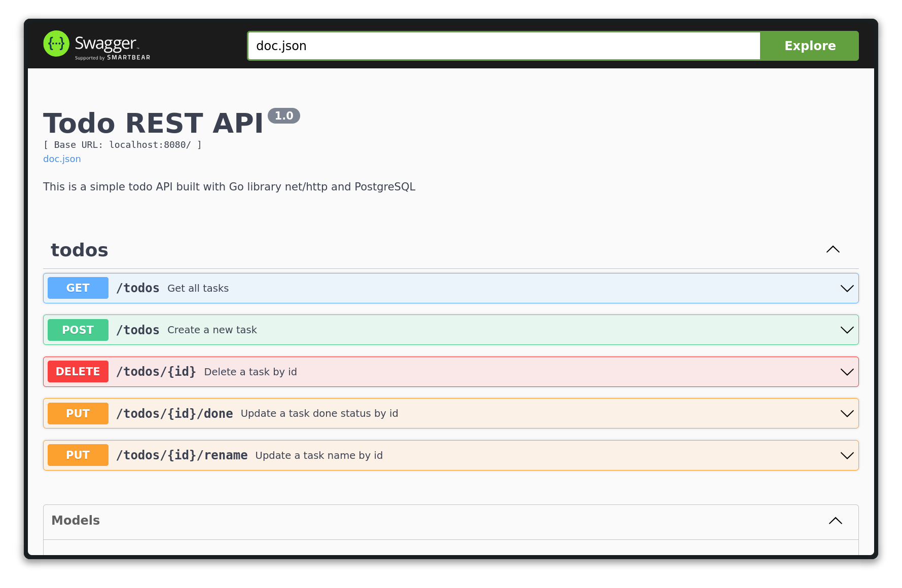

# 📝 Go Native REST Todo API



A lightweight and native RESTful Todo API built using Go's standard `net/http` library and PostgreSQL.
This project is ideal for learning how to build REST APIs in Go without external routing frameworks.

## 📦 Features

- 📋 CRUD operations for Todo items
- ⚡ Native `net/http` routing
- 🗄 PostgreSQL integration with UUID primary keys
- 🧪 Swagger documentation (`swaggo`)
- 🛠 Auto-creation of the `todos` table on startup
- 🔒 Secure ID generation via `pgcrypto`

## 🚀 Getting Started

### 🔧 Prerequisites

- Go 1.24+
- PostgreSQL
- [swag CLI](https://github.com/swaggo/swag) (for generating Swagger docs)

### 📁 Clone and Setup

```bash
git clone https://github.com/your-username/go-native-rest-todo.git
cd go-native-rest-todo
```

### 🗃 Create Database

```sql
CREATE DATABASE tododb;
```

### 🧪 Run the Project

```sql
go run .
```

Server will be available at:

- 🌐 http://localhost:8080
- 📚 Swagger UI: http://localhost:8080/swagger/index.html


### 📚 API Endpoints

| Method | Endpoint      | Description       |
| ------ | ------------- | ----------------- |
| GET    | `/todos`      | Get all todos     |
| POST   | `/todos`      | Create a new todo |
| PUT    | `/todos/{id}` | Update a todo     |
| DELETE | `/todos/{id}` | Delete a todo     |

All endpoints are documented in Swagger.


### 🧪 Generate Swagger Docs

Make sure you have swag installed:

```bash
go install github.com/swaggo/swag/cmd/swag@latest
```

Then generate the docs:

```bash
swag init
```

### 🧪 Environment Variables

For working with the application, you need to set the following environment variables:

- `DB_HOST`: The hostname or IP address of your PostgreSQL server.
- `DB_PORT`: The port number of your PostgreSQL server.
- `DB_USER`: The username for your PostgreSQL database.
- `DB_PASSWORD`: The password for your PostgreSQL database.
- `DB_NAME`: The name of your PostgreSQL database.

### 🧰 Project Structure

.
├── main.go            # Entry point
├── db.go              # DB initialization and table creation
├── todo.go            # Todo handlers and models
├── handlers.go        # Todo handlers and models
├── models.go          # Todo models
├── docs/              # Swagger generated docs
└── go.mod

## 📄 License

MIT License
